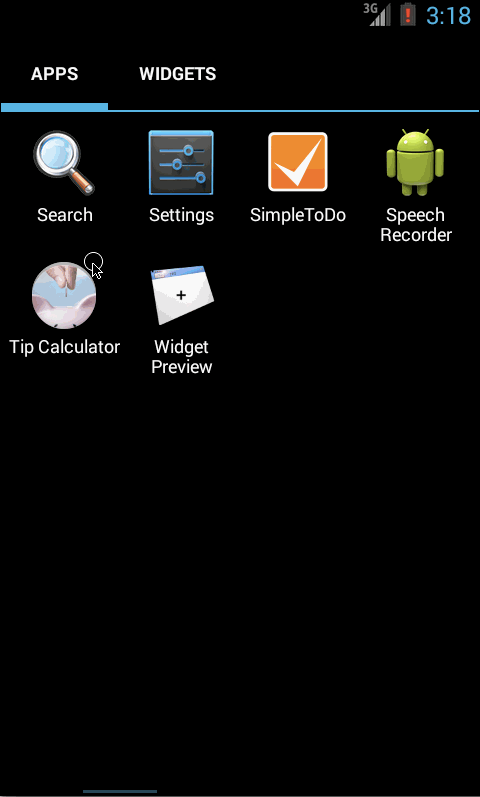

# Read Me for Tip Calculator
By Suhas Maskar

This app lets your enter you bill amount and select from 3 pre-selected tips percentage. You can press "Done" on your keyboard to select the default 10% tip or click on any of the 3 Tips%. You will see the selected tips% highlighted and your tips amount & total amount calculated.

Time spent: 2-3 hours spent in total

Completed user stories:

 * [x]  User is displayed the tip of specified percentage for specified entered amount
 * [x]	User enters the total amount of the transaction
 * [x]	User can select between tip amounts (i.e 10%, 15%, 20%)
 * [x]	Upon selecting tip amount, formatted tip value is displayed
 * [x]	User changes the total amount and updated tip is reflected automatically (Optional- Completed) 
 * [x]	Improve the user interface and experience by using images and/or colors (Optional- Completed) 
 * [x]	Added keyboard done actions, default tips% selection and highlighting the tips% button that was selected and then display the total bill 
 
Installation: 
Run the installation .apk file and it will prompt to install. After installation just run the "Tips Calculator" from your Applications.

Walkthrough of all user stories:

